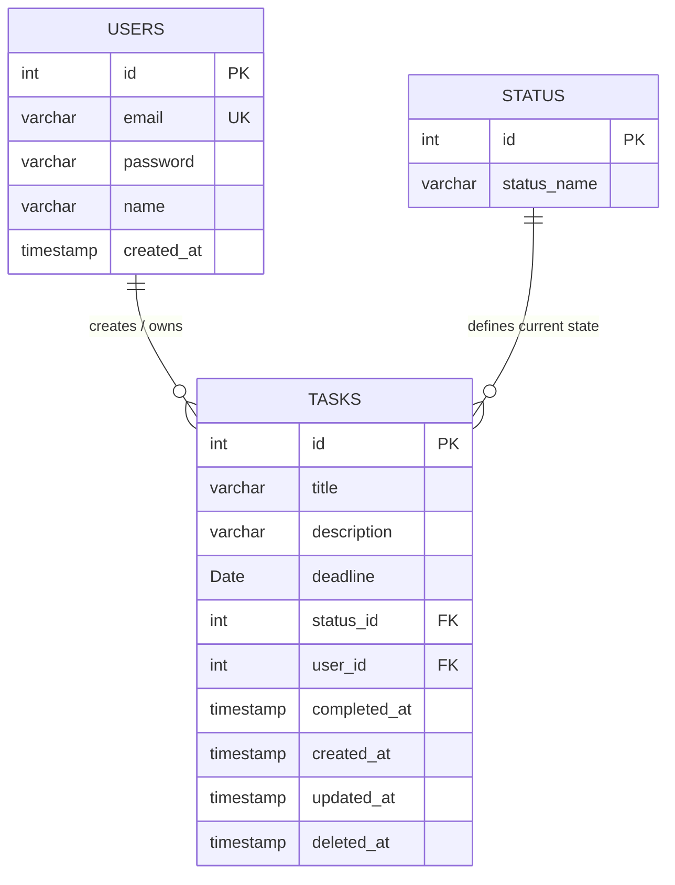
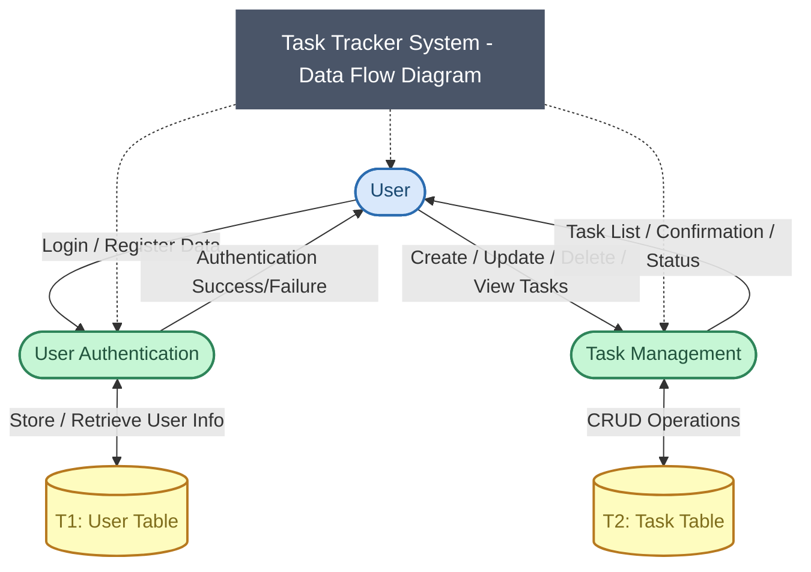

# Diagrams

## ER Diagram

```mermaid
erDiagram
    USERS ||--o{ TASKS : "creates / owns"
    STATUS ||--o{ TASKS : "defines current state"

    USERS {
        int id PK
        varchar email UK
        varchar password
        varchar name
        timestamp created_at
    }

    TASKS {
        int id PK
        varchar title
        varchar description
        Date deadline
        int status_id FK
        int user_id FK
        timestamp completed_at
        timestamp created_at
        timestamp updated_at
        timestamp deleted_at
    }

    STATUS {
        int id PK
        varchar status_name  
    }
```

## Data Flow Diagram

```mermaid
flowchart TD

    Title[Task Tracker System - Data Flow Diagram]:::title

    User([User]):::entity

    P1([ User Authentication]):::process
    P2([ Task Management]):::process

    D1[(T1: User Table)]:::datastore
    D2[(T2: Task Table)]:::datastore

    User -->|"Login / Register Data"| P1
    P1 <-->|"Store / Retrieve User Info"| D1
    P1 -->|"Authentication Success/Failure"| User

    User -->|"Create / Update / Delete / View Tasks"| P2
    P2 <-->|"CRUD Operations"| D2
    P2 -->|"Task List / Confirmation / Status"| User

    Title -.-> User & P1 & P2

    classDef title fill:#4a5568,stroke:none,color:#fff,font-size:18px,text-align:center;
    classDef entity fill:#d9e8fb,stroke:#2b6cb0,stroke-width:2px,color:#1a4971;
    classDef process fill:#c6f6d5,stroke:#2f855a,stroke-width:2px,color:#22543d;
    classDef datastore fill:#fefcbf,stroke:#b7791f,stroke-width:2px,color:#7f6d1c;
```
**Next:** [Tech Stack →](TechStack.md)