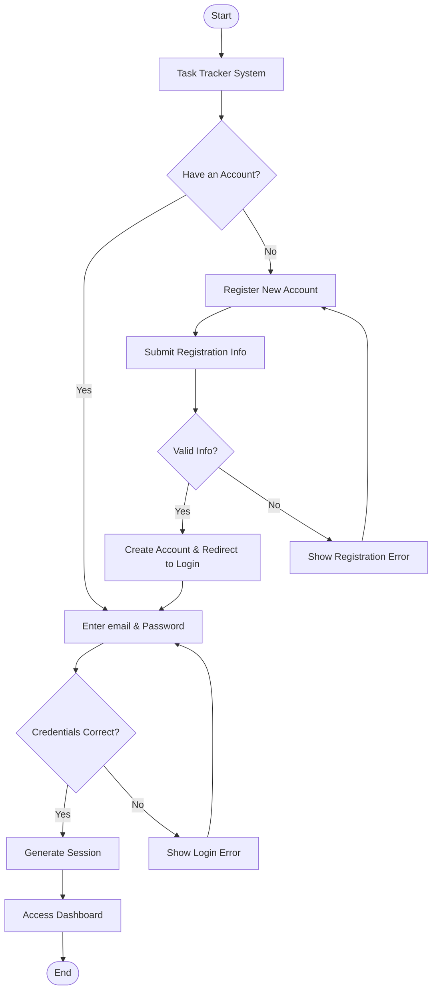
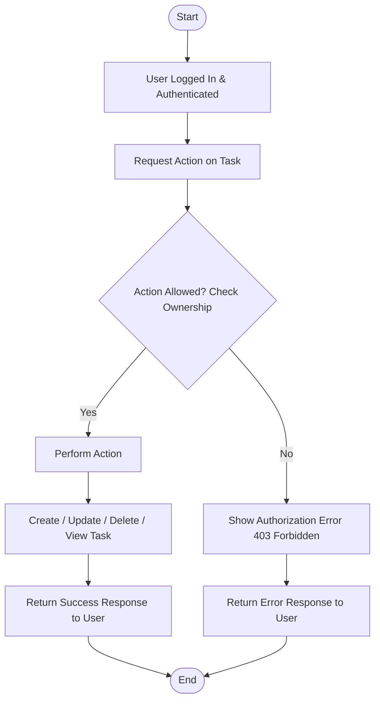

## Authentication 

```mermaid
flowchart TD
    Start([Start]) --> A[Task Tracker System]
    A --> B{Have an Account?}
    
    B -->|Yes| C[Enter email & Password]
    B -->|No| D[Register New Account]
    
    D --> E[Submit Registration Info]
    E --> F{Valid Info?}
    F -->|Yes| G[Create Account & Redirect to Login]
    F -->|No| H[Show Registration Error]
    H --> D
    
    G --> C
    
    C --> I{Credentials Correct?}
    I -->|Yes| J[Generate Session]
    I -->|No| K[Show Login Error]
    K --> C
    
    J --> L[Access Dashboard]
    L --> End([End])
```

---
## Authorisation

```mermaid
flowchart TD
    Start([Start]) --> A[User Logged In & Authenticated]
    A --> B[Request Action on Task]
    B --> C{"Action Allowed? Check Ownership"}
    
    C -->|Yes| D[Perform Action]
    C -->|No| E[Show Authorization Error 403 Forbidden]
    
    D --> F[Create / Update / Delete / View Task]
    F --> G[Return Success Response to User]
    E --> H[Return Error Response to User]
    
    G --> End([End])
    H --> End([End])
```